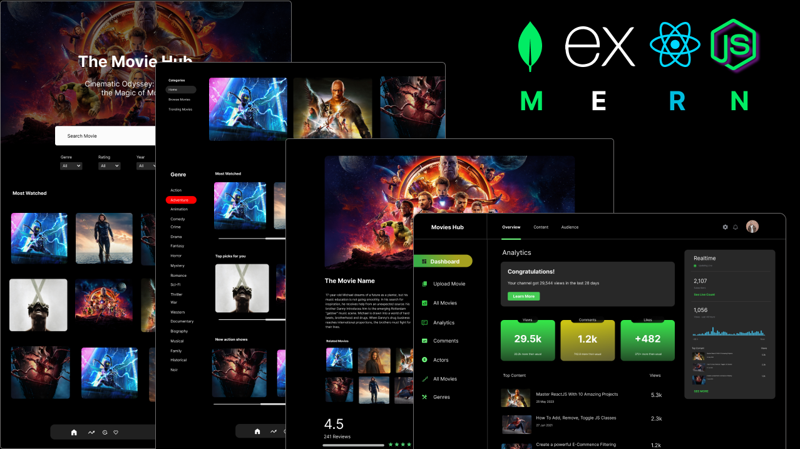

# 🎬 MERN Movies App

Welcome to the **MERN Movies App**! This is a full-stack web application that allows users to explore and search for movies. It uses the MERN stack, which stands for MongoDB, Express.js, React.js, and Node.js. This project demonstrates how to create a responsive movie database application.

---

## 📸 Demo



> Check out the live demo of the app [here](http://your-live-demo-link).

---

## 🚀 Features

- **Search Movies**: Search for movies using their titles.
- **Movie Details**: View detailed information about each movie, including its poster, rating, and plot.
- **User Authentication**: Sign up, log in, and manage your account.
- **Responsive Design**: Fully responsive layout that works on desktop and mobile devices.
- **Favoriting**: Mark movies as favorite and save them for later viewing.

---

## 🛠️ Technologies Used

This project was built with the following technologies:

- **MongoDB**: NoSQL database to store movie information.
- **Express.js**: Web framework for Node.js to handle server-side logic.
- **React.js**: JavaScript library for building user interfaces.
- **Node.js**: JavaScript runtime for the backend.
- **JWT Authentication**: For user login and token-based authentication.
- **Axios**: Promise-based HTTP client for making requests.
- **React Router**: For routing between pages.
- **Material-UI**: For sleek and modern UI components.

---

## 🧰 Installation

### Prerequisites

- Node.js: [Download and install Node.js](https://nodejs.org/)
- MongoDB: [Download and install MongoDB](https://www.mongodb.com/try/download/community)

### Steps

1. **Clone the repository**:
   ```bash
   git clone https://github.com/CHOUMR11/MERN-Movies-App.git
   cd MERN-Movies-App
